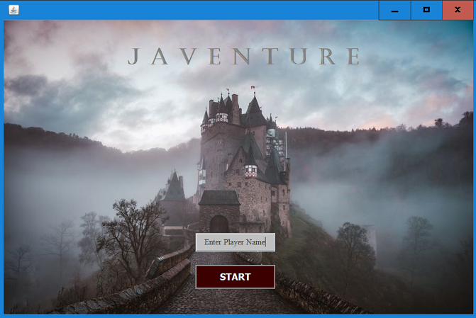
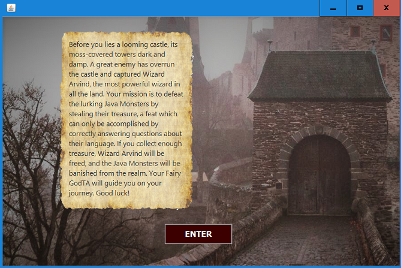
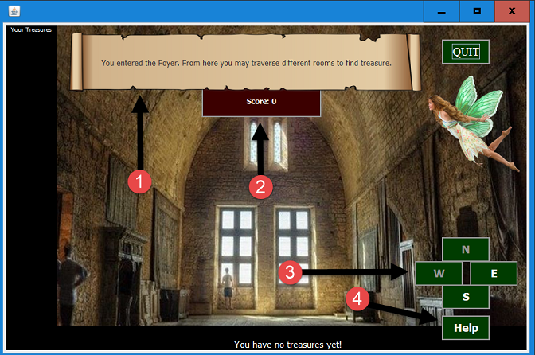
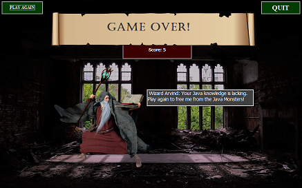

# Final Project - Team 30 - Javenture Game

*Team Members*

Diane Hoffstetter | Jen Macklin | Murrai Scanlon

### Overview

Tired of studying for the Java exam? Are you interested in an alternative method for learning foundational knowledge of the Java programming language? Look no further than Javenture, a role playing game designed to test the player's knowledge of Java. 

### Description
:european_castle:  :moneybag:  

Javenture is an adventure game where a player traverses a castle, collecting treasure in order to free a great wizard. Lurking in the castle are Java monsters who hold the key to freeing the wizard. The player collects treasure only if they correctly answer a question about Java, the monsters' native language. 

### Technical Requirements and Information

* Java version 1.8 or later
* Java Swing (some game components do not render ideally on MacOS)
* JUnit 5
* Package game
* SwingGameRunner includes the main method and is the entry point for the program

*Download and Run Instructions* : Clone the repository and run the SwingGameRunner.java file.

### Graphical Game Play Instructions

**1. Start Page:** Enter the player's name and click start to begin the learning adventure!

**2. Story Page:** Be sure to read the background story to discover the details of your mission.

**3. Instruction Page:** Read the instructions to get yourself going, but you can always click on the 'Help' button inside the game if you forget something.

**4. Castle Foyer Page:**  Your journey begins in the castle Foyer. The scroll at the top will describe your current location in the castle and the green direction buttons will allow you to move around the castle looking for the Java Monsters' treasure. If the direction buttons are grayed-out, there is not an adjacent room in that direction. Your adventure is your own at this point, there are many rooms to explore! Notice that you start with a score of 0. Remember, you must earn 20 points to free the captured Wizard!

**5. Treasure Box Locations:** Treasures are located randomly throughout the castle rooms, so you are never really playing the same path twice. Once you find a treasure box, you only need the courage to open it. Click on the treasure box and be prepared to have your knowledge of the Java programming language tested!

**6. Question/Answer Window:** So you have the bravery to open the box, but do you have the knowledge to earn the treasure? Answer the question posed by the aptly named Java Monsters to find out. You may click the 'Hint' button for help from the FairyGodTa, but it will cost you points. If you answer incorrectly, you will be alerted and sent back to your journey path empty handed.

**7. Progress Display Features:** Once you have earned a treasure, it will be displayed visually on the left side of the screen and in text at the bottom of the screen. Your score is updated toward the top of the screen according to the games scoring rules.

**8. Game Over:** 
The screen you see at the end is determined by your Java prowess. Recover enough Java Monster treasure to earn 20 points and you are graced with accolades from the Wizard himself. However, if you falter and miss three questions before reaching the target score, you will only receive encouragement to try again.

 

#### Class Descriptions

* **AnswerChoiceRadioButtons** - Extends JRadioButton to improve code reuse and readability in QuestionBoxDialog class.
* **DirectionButton** - Extends JButton to improve code reuse and readability in SwingRoom.
* **GameStatus** - Enum provided to streamline game operations.
* **Instructions** - Displays game play instructions before the player enters the Foyer and works with SwingRoom to make instructions available through help button. 
* **Question/Questions/QuestionReader** - Sets up multiple choice questions with hint, reads in .csv of questions, and populates method to feed questions when player attempts to collect Treasures. 
* **QuestionBoxDialog** - Sets up formating and GUI functionality for the user to interact with the Questions.
* **QuestionEvent/QuestionBoxListener** - Works with QuestionBoxDialog to communicate user events to other parts of the program.
* **RandomOrderGenerator** - Works with SwingRoom and Treasures to place treasures randomly in rooms as the user navigates from room to room.
* **Room/Rooms/SwingRoom** - Models a room with room id, loads all room data from csv file, and puts the room links into a separate HashMap to set up connections between rooms. Collaborates with Treasures, QuestionDialogBox, Score, RandomOrderGenerator, and DirectionButton.
* **Score** - Keeps track of running score and displays final score at the end of game.
* **SwingStoryPage** - Displays the background story for the player.
* **_SwingGameRunner_** - Contains the **main method** and is the gateway to the game. Also the Splash page and used to collect player name as input.
* **SwingGameOver** - Establishes the final window of the game and shows win/loss status.
* **Treasure/Treasures** - Sets up treasure attributes and populates an ArrayList of Treasures to go in Rooms.
* **Treasure Label** - Extends JLabel to improve code reuse and readability in Treasures.
* **UIPanel** - Extends JPanel to improve code reuse and readability in QuestionBoxDialog and Instruction classes.

#### JUnit Tests

* Question and Questions Tests
* Room and Rooms Tests
* Score Test
* Treasure and Treasures Tests

